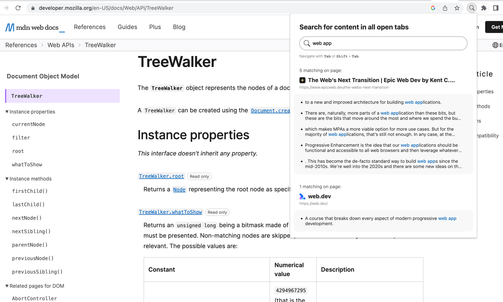
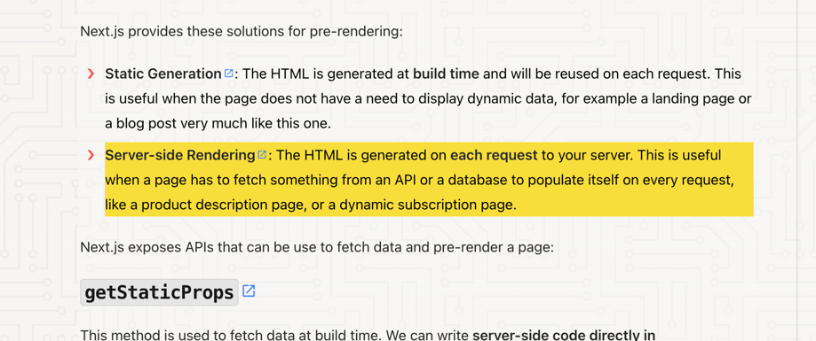

# Search tab content

This is a custom chrome extension used for searching text content in all open tabs of a browser window.
A search result can be quickly accessed by clicking the matching text in the list of results.
This will navigate to the correct tab, scroll text node into view and highlight it with a yellow background.

### How it works

When the extension is launched and the search app is mounted it injects a content-script in each tabs environment, which does two things:  
1. Using a [TreeWalker](https://developer.mozilla.org/en-US/docs/Web/API/TreeWalker) it traverses and filters out all text nodes in the document body based on some basic criteria, like not being hidden by css and not being an empty string.
2. It sets a unique classname on each potential search result in the DOM
3. It reports back with all text data and the class name used as an anchor for the potential search result.
4. It sets up an event listener that can be accessed by the extension for navigating and highlighting a clicked search result based on the class name.

When a search query is entered by the user, all matching text nodes are displayed in a list of results, grouped by tab.
The groups are ordered by number of matching nodes.

When a result is clicked, the user is navigated to the correct tab & element, which is briefly highlighted with a yellow background.

